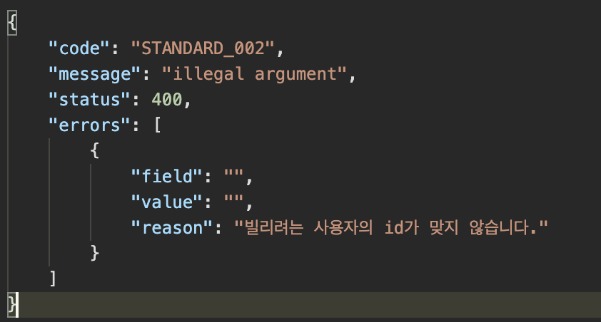
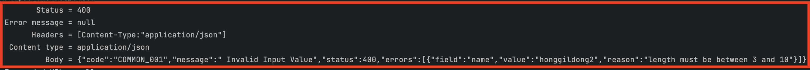
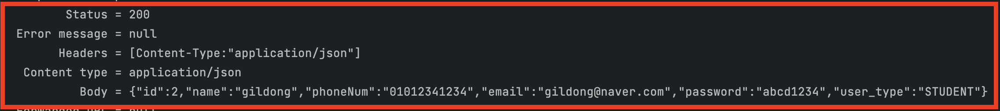

# 도입

---

학교 프로젝트에서 서버를 스프링으로 구축하였었다. 

이 때 어떻게 예외처리를 처리할지 고민을 많이 하였고, github에서 마침 좋은 내용을 발견하여 적용하였다.

이 때 예외를 핸들링한 경험을 포스팅 해보려 한다. 

# Exception Handler 작성

---

> 예외 발생 시 Response Body를 특정한 형태의 객체 타입으로
> 미리 지정한 status code를 함께 반환하는 클래스를 작성해보자.

## ErrorResponse

> ErrorResponse는 클라이언트에게 반환되는 Response Body의 형태이다.

예외 발생 시 아래 형태처럼 Response Body가 반환된다. 



이제 실제로 코드를 작성해보자.

`ErrorResponse` 클래스를 작성하고 코드를 아래처럼 작성해주면 된다.

```java
public class ErrorResponse {
    private String code;
    private String message;
    private int status;
    private List<CustomFieldError> errors;

    public static class CustomFieldError{
        private String field;
        private String value;
        private String reason;

        private CustomFieldError(String field, String value, String reason) {
            this.field = field;
            this.value = value;
            this.reason = reason;
        }

        private CustomFieldError(FieldError fieldError){
            this.field = fieldError.getField();
            this.value = fieldError.getRejectedValue().toString();
            this.reason = fieldError.getDefaultMessage();
        }

        public String getField() { return field; }
        public String getValue() { return value; }
        public String getReason() { return reason; }
    }

    private void setErrorCode(ErrorCode errorCode){
        this.code = errorCode.getCode();
        this.message = errorCode.getMessage();
        this.status = errorCode.getStatus();
    }

    private ErrorResponse(ErrorCode errorCode, List<FieldError> errors) {
        setErrorCode(errorCode);
        this.errors = errors.stream().map(CustomFieldError::new).collect(Collectors.toList());
    }

    private ErrorResponse(ErrorCode errorCode, String exceptionMessage) {
        setErrorCode(errorCode);
        this.errors = List.of(new CustomFieldError("", "", exceptionMessage));
    }

    public static ErrorResponse of(ErrorCode errorCode){
        return new ErrorResponse(errorCode, Collections.emptyList());
    }

    public static ErrorResponse of(ErrorCode errorCode, BindingResult bindingResult){
        return new ErrorResponse(errorCode, bindingResult.getFieldErrors());
    }

    public static ErrorResponse of(ErrorCode errorCode, String exceptionMessage){
        return new ErrorResponse(errorCode, exceptionMessage);
    }

    public String getCode() { return code; }
    public String getMessage() { return message; }
    public int getStatus() { return status; }
    public List<CustomFieldError> getErrors() { return errors; }
}
```

필드에 대해 간략한 설명은 다음과 같다.

* code : 미리 정의한 에러 코드

* message : 에러 메시지에 대한 요약

* status : status code

* errors : 발생한 각 에러들에 대해 좀 더 자세한 내용.

> 한 가지 주의할 점은 꼭 각 필드의 getter 메서드를 제공해줘야 한다.
> 객체를 json 형태의 ResponseBody로 매핑하는데 `MappingJackson2HttpMessageConverter`가 사용되는데
> 객체의 정보를 가져오기 위해 Getter를 사용한다.

`code`, `message`, `status`는 미리 `ErrorCode`라는 enum 으로 정의해 놓자.

`ErrorCode` enum class를 만들고 아래와 같이 작성하자. 

```java
public enum ErrorCode {
    // Common
    INVALID_INPUT_VALUE(400, "COMMON_001", " Invalid Input Value"),
    METHOD_NOT_ALLOWED(405, "COMMON_002", "Method not allowed"),
    HANDLE_ACCESS_DENIED(403, "COMMON_003", "Access is Denied"),

    // Standard
    ILLEGAL_STATE(400, "STANDARD_001", "illegal state"),
    ILLEGAL_ARGUMENT(400, "STANDARD_002", "illegal argument"),

    // Exception
    EXCEPTION(500, "EXCEPTION", "exception");

    private final String code;
    private final String message;
    private int status;

    ErrorCode(final int status, final String code, final String message) {
        this.status = status;
        this.message = message;
        this.code = code;
    }

    protected String getCode() { return code; }
    protected String getMessage() { return message; }
    protected int getStatus() { return status; }
}
```

이렇게 enum으로 만들어놓고 `ErrorResponse`를 생성할 때 `of` 메서드의 인자로 넘겨주자.

## ExceptionHandlerExceptionResolver

> Spring DispatcherServlet의 default 예외 핸들링 전략 중 하나이다.
> `@ExceptionHandler` 어노테이션이 붙은 메서드에서 예외를 처리한다.

`@ExceptionHandler` 어노테이션은 Controller 또는 ControllerAdvice 에 붙일 수 있다. 

우리는 ControllerAdvice에 `@ExceptionHandler`를 적용하여 모든 컨트롤러에서 발생하는 예외에 대해 공통적으로 공통적으로 처리할 것이다.

> `ResponseStatusExceptionResolver`라는 전략을 이용하는 방법도 있다. 
> 작성한 예외 클래스에 `@ResponseStatus` 를 붙여서 처리할 수 있는 방법이다.
> 하지만 일괄적인 처리와 최대한 표준예외를 활용할 예정이므로 `ExceptionHandlerExceptionResolver`를 활용하자.

> default 전략에 대해서는 [DispatcherServlet 의 Default 전략](default-strategies) 를 참고하기 바란다.

## @ControllerAdvice

> Controller 클래스에 공통된 기능을 적용하기 위해 AOP를 사용하는 어노테이션.
> 우리는 이것을 예외 핸들링에 사용할 것이다.

`GlobalExceptionHandler` 클래스를 만들고 아래와 같이 작성한다.

```java
@ControllerAdvice
@Slf4j
public class GlobalExceptionHandler {
    /**
     *  javax.validation.Valid or @Validated 으로 binding error 발생시 발생한다.
     *  HttpMessageConverter 에서 등록한 HttpMessageConverter binding 못할경우 발생
     *  주로 @RequestBody, @RequestPart 어노테이션에서 발생
     */
    @ExceptionHandler(MethodArgumentNotValidException.class)
    protected ResponseEntity<ErrorResponse> handleMethodArgumentNotValidException(MethodArgumentNotValidException e) {
        log.error("handleMethodArgumentNotValidException", e.getMessage());
        final ErrorResponse response = ErrorResponse.of(ErrorCode.INVALID_INPUT_VALUE, e.getBindingResult());
        return new ResponseEntity<>(response, HttpStatus.BAD_REQUEST);
    }

    /**
     * @ModelAttribut 으로 binding error 발생시 BindException 발생한다.
     * ref https://docs.spring.io/spring/docs/current/spring-framework-reference/web.html#mvc-ann-modelattrib-method-args
     */
    @ExceptionHandler(BindException.class)
    protected ResponseEntity<ErrorResponse> handleBindException(BindException e) {
        log.error("handleBindException", e);
        final ErrorResponse response = ErrorResponse.of(ErrorCode.INVALID_INPUT_VALUE, e.getBindingResult());
        return new ResponseEntity<>(response, HttpStatus.BAD_REQUEST);
    }

    /**
     * enum type 일치하지 않아 binding 못할 경우 발생
     * 주로 @RequestParam enum으로 binding 못했을 경우 발생
     */
    @ExceptionHandler(MethodArgumentTypeMismatchException.class)
    protected ResponseEntity<ErrorResponse> handleMethodArgumentTypeMismatchException(MethodArgumentTypeMismatchException e) {
        log.error("handleMethodArgumentTypeMismatchException", e);
        final ErrorResponse response = ErrorResponse.of(ErrorCode.INVALID_INPUT_VALUE);
        return new ResponseEntity<>(response, HttpStatus.BAD_REQUEST);
    }

    /**
     * 지원하지 않은 HTTP method 호출 할 경우 발생
     */
    @ExceptionHandler(HttpRequestMethodNotSupportedException.class)
    protected ResponseEntity<ErrorResponse> handleHttpRequestMethodNotSupportedException(HttpRequestMethodNotSupportedException e) {
        log.error("handleHttpRequestMethodNotSupportedException", e);
        final ErrorResponse response = ErrorResponse.of(ErrorCode.METHOD_NOT_ALLOWED);
        return new ResponseEntity<>(response, HttpStatus.METHOD_NOT_ALLOWED);
    }

    /**
     * Authentication 객체가 필요한 권한을 보유하지 않은 경우 발생합
     */
    @ExceptionHandler(AccessDeniedException.class)
    protected ResponseEntity<ErrorResponse> handleAccessDeniedException(AccessDeniedException e) {
        log.error("handleAccessDeniedException", e);
        final ErrorResponse response = ErrorResponse.of(ErrorCode.HANDLE_ACCESS_DENIED);
        return new ResponseEntity<>(response, HttpStatus.valueOf(ErrorCode.HANDLE_ACCESS_DENIED.getStatus()));
    }

    /**
     * 비즈니스 로직 수행 도중, 사용자의 요청 파라미터가 적절하지 않을 때 발생
     */
    @ExceptionHandler(IllegalStateException.class)
    protected ResponseEntity<ErrorResponse> handleIllegalStatementException(IllegalStateException e){
        log.error("illegalStateException", e);
        final ErrorResponse response = ErrorResponse.of(ErrorCode.ILLEGAL_STATE, e.getMessage());
        return new ResponseEntity<>(response, HttpStatus.BAD_REQUEST);
    }

    /**
     * 비즈니스 로직 수행 도중, 해당 도메인 객체의 상태가 로직을 수행할 수 없을 때 발생
     */
    @ExceptionHandler(IllegalArgumentException.class)
    protected ResponseEntity<ErrorResponse> handleIllegalArgumentException(IllegalArgumentException e){
        log.error("illegalArgumentException", e);
        final ErrorResponse response = ErrorResponse.of(ErrorCode.ILLEGAL_ARGUMENT, e.getMessage());
        return new ResponseEntity<>(response, HttpStatus.BAD_REQUEST);
    }

    /**
     * 여기서 작성하지 않은 다른 모든 예외에 대해 처리한다. 이 때 500 status code와 함께 반환한다.
     */
    @ExceptionHandler(Exception.class)
    protected ResponseEntity handleException(Exception e) {
        log.error("exception", e);
        final ErrorResponse response = ErrorResponse.of(ErrorCode.EXCEPTION, e.getMessage());
        return new ResponseEntity<>(response, HttpStatus.INTERNAL_SERVER_ERROR);
    }
}
```

`GlobalExceptionHandler` 클래스에는 `@ControllerAdvice`가 붙여져 있고, `@ExceptionHandler`가 메서드 마다 붙여져 있다. 

컨트롤러에서 예외가 발생하면 `@ExceptionHanlder`에 인자로 주어진 예외 클래스에 매칭되는지 확인하고, 메서드를 실행하게 된다.

만약 매칭되는 예외 클래스가 없다면 `ResponseStatusExceptionResolver` 또는 `DefaultHandlerExceptionResolver` 가 해당 예외를 처리한다.

메서드들의 다 형태는 비슷하니 이 중 하나만 설명해보겠다.

아래는 `IllegalArgumentException` 을 처리하는 메서드이다.

```java
/**
 * 비즈니스 로직 수행 도중, 해당 도메인 객체의 상태가 로직을 수행할 수 없을 때 발생₩
 */
@ExceptionHandler(IllegalArgumentException.class)
protected ResponseEntity<ErrorResponse> handleIllegalArgumentException(IllegalArgumentException e){
    log.error("illegalArgumentException", e);
    final ErrorResponse response = ErrorResponse.of(ErrorCode.ILLEGAL_ARGUMENT, e.getMessage());
    return new ResponseEntity<>(response, HttpStatus.BAD_REQUEST);
}
```

여기서 총 3가지를 작업을 수행한다.

1. 서버에 로그를 남긴다.
   
2. ErrorResponse 객체를 만든다.
   
3. 400 status code와 함께 ErrorResponse 객체를 클라이언트한테 반환한다.

# 사용자 요청 형식 검증

> 우리는 API에 총 2가지의 검증을 적용 할 것이다. 
> 사용자 요청 형식 검증과 비즈니스 로직 검증이다.
> 이 검증들은 실패 시 예외를 던지게 되고, 이를 위에서 작성한 `GlobalExceptionHandler`가 처리한다.

사용자 요청에 대한 형식 검증은 총 2가지 단계로 이루어진다.

1. 해당 타입 변환이 불가능한 경우 -> `BindException`이 발생하여 `GlobalExceptionHandler`가 처리

2. 타입 변환에 성공했지만 검증기인 `Validator`의 검사를 통과하지 못했을 경우 -> `MethodArgumentNotValidException`가 발생하여 `GlobalExceptionHandler`에서 처리

1번은 자동으로 되지만, 2번의 경우 우리가 `Validator`를 적용시켜야 한다.

`Validator` 가 뭔지 먼저 알아보자.

## Validator란 

> 오브젝트에 대한 검증을 하는 인터페이스로, 특정 타입의 오브젝트를 검증하고 싶다면 인터페이스를 구현하여야 한다.

아래는 `Validator` 인터페이스이다. 아래에서 보는 것처럼 2개의 메서드를 지원한다.

```java
public interface Validator{
    boolean supports(Class<?> clazz);
    void validate(Object target, Errors errors);
}
```

이를 구현한 클래스의 예는 다음과 같다. 

직접 사용할 것도 아니니 이렇게 구현한다는 것만 알면 된다.

```java
public class UserValidator implements Validator{
    public boolean supports(Class<?> clazz){
        return (User.isAssignableForm(clazz));
    }
    
    public void validate(Object target, Errors errors){
        User user = (User) target;
        ValidationUtils.rejectIfEmpty(errors, "name", "field.required");
        if(user.getAge() < 0)
            errors.rejectValue("name", "field.min", new Object[] {0}, null);
    }
}
```

이렇게 우리는 `Validator` 의 구현 클래스를 알아 보았다.

하지만 모든 사용자의 요청 타입에 대해 `Validator` 구현 클래스를 작성하는 것은 쉽지 않은 일이므로, `JSR-303`의 빈 검증 기능을 사용하자.

`JSR-303`은 오브젝트의 필드에 제약조건 어노테이션을 붙여 `Validator`처럼 검증을 진행할 수 있게 해준다.

> 정확히는 어댑터 역할을 하는 LocalValidatorFactoryBean이
> JSR-303의 검증 기능을 스프링의 Validator처럼 사용할 수 있도록 해준다.

그러면 이를 활용한 예를 살펴보자.

```java
public class User{
    @NotNull // 무조건 있어야 한다.
    String name;
    
    @Min(0) // 최솟값이 0이다.
    int age;
    
    @Email // email 형식이어야 한다.
    String email;
}
```

위에서 각 필드에 붙은 애너테이션의 종류마다 특정한 형태를 만족하는지 검사하게 된다.

어떤 애너테이션이 있는지는 필요할 때마다 찾아보자. 

이제 이 `Validator`를 적용하는 방법에 대해 알아보자.

## Validator 적용

`Validator`를 적용하는 방법은 2가지가 있다.

1. `Validator`인터페이스를 구현한 클래스의 `validate()`메서드를 호출하여 검증

2. `@Valid` 어노테이션을 파라미터 앞에 붙여 적용

앞서서 `JSR-303`의 빈 검증 기능을 통해 검증을 수행한다고 했다.

이 때 2번을 통해 매우 간단히 적용할 수 있으므로 2번을 사용해보자.

아래는 프로젝트에서 작성한 `UserController`의 메서드 중 하나이다.

```java
@PostMapping("/api/user/join")
public UserResponse join(@RequestBody @Valid JoinRequest joinRequest){
    return joinService.join(joinRequest);
}
```

파라미터 `JoinRequest` 앞에 `@Valid`가 붙은 것을 볼 수 있다. 

이 `@Valid` 어노테이션이 붙은 파라미터는 자동으로 검증을 거치게 되고 `JoinRequest`의 필드들에 붙은 애너테이션을 이용해 검증을 수행하게 된다.

만약 검증에 실패하게 되면 `handleMethodArgumentNotValidException` 예외를 던지게 된다.

아래는 실제 프로젝트에서 사용된 RequestDto인 `JoinRequest`이다.

```java
public class JoinRequest {
    @NotBlank
    @Length(min=3, max=10)
    private String name;

    @NotBlank
    @Pattern(regexp = "[0-9]{10,11}")
    private String phoneNum;

    @NotBlank
    @Email
    private String email;

    @NotBlank
    @Length(min=8, max=16)
    private String password;
    ...
}
```

사용자 요청이 이 형식을 만족하지 않으면 어떻게 되는지 테스트로 확인해보자.

## test로 확인

다음과 같이 테스트 클래스를 만들자.

이름의 길이에 대해서 한번 테스트 해보자.

```java
import com.example.bookreservationserver.advice.ErrorCode;
import com.example.bookreservationserver.user.dto.JoinRequest;
import com.fasterxml.jackson.databind.ObjectMapper;
import org.junit.jupiter.api.Test;
import org.springframework.beans.factory.annotation.Autowired;
import org.springframework.boot.test.autoconfigure.web.servlet.AutoConfigureMockMvc;
import org.springframework.boot.test.context.SpringBootTest;
import org.springframework.test.web.servlet.MockMvc;

import static org.hamcrest.core.Is.is;
import static org.springframework.test.web.servlet.request.MockMvcRequestBuilders.post;
import static org.springframework.test.web.servlet.result.MockMvcResultHandlers.print;
import static org.springframework.test.web.servlet.result.MockMvcResultMatchers.jsonPath;
import static org.springframework.test.web.servlet.result.MockMvcResultMatchers.status;

@SpringBootTest
@AutoConfigureMockMvc
class UserApiTest {
    public static JoinRequest correctRequest = new JoinRequest("gildong", "01012341234", "gildong@naver.com", "abcd1234");

    public static ObjectMapper objectMapper = new ObjectMapper();

    @Autowired
    protected MockMvc mockMvc;

    @Test
    public void validateJoinRequestName() throws Exception {
        JoinRequest joinRequest = new JoinRequest("honggildong2", correctRequest.getPhoneNum()
                , correctRequest.getEmail(), correctRequest.getPassword());

        String expectedFailRequest = objectMapper.writeValueAsString(joinRequest);
        String expectedSuccessRequest = objectMapper.writeValueAsString(correctRequest);

        // 유저의 이름이 10자보다 길어서 실패하는 경우 
        mockMvc.perform(post("/api/user/join")
                .contentType("application/json") // json 타입으로 request body를 보낸다.
                .content(expectedFailRequest))
                .andExpect(status().isBadRequest()) // 400 status code 응답을 예상한다.
                .andDo(print()) // 결과를 출력한다.
                .andExpect(jsonPath("$.code", is(ErrorCode.INVALID_INPUT_VALUE.getCode()))); // code 파라미터의 내용이 COMMON_001 인지 확인한다.

        // 유저의 이름의 길이가 조건을 만족해서 성공하는 경우다.
        mockMvc.perform(post("/api/user/join")
                .contentType("application/json")
                .content(expectedSuccessRequest))
                .andDo(print()) // 결과를 출력한다.
                .andExpect(status().isOk()); // 200 status code를 예상한다.
    }
    ...
}
```

아래 그림처럼 test case honggildong2의 경우 길이가 길어 

400 status code와 ErrorResponse 형태로 Body를 반환한다.



test case gildong의 경우는 성공함을 볼 수 있다.



# Business Logic 검증

---

앞서 형식검증에 이어 Business 로직 검증도 해보겠다. 

실제 프로젝트에서 했던 책 대여에 대해서 예외를 던져서 처리하도록 하자.

비즈니스 로직은 직접 작성할 수도 있지만, 표준 예외를 적극적으로 활용하려 한다.

사용할 표준 예외는 `IllegalArgumentException`과 `IllegalStateException`이다.

> Effective Java - item 72 : 표준 예외를 사용하라.

## 간단한 비즈니스 로직

책 반납에 대한 비즈니스 로직에 대한 예외 처리를 하려 한다. 

아래는 `Borrow` 엔티티로, 책 대여 관련 정보를 담고 있다.

책을 반납할 때, 이미 반납한 상태라면 다시 반납할 수 없다는 예외를 던지게 된다.

```java
@Entity
@Access(AccessType.FIELD)
public class Borrow {
    ...
    public void returned() {
        if (state == BorrowState.RETURNED) throw new IllegalStateException("이미 반납이 완료되었습니다.");
        state = BorrowState.RETURNED;
    }
    ...
}
```

## 여러 개의 도메인 객체들이 함께 동작하는 비즈니스 로직

이번에는 여러개의 도메인 객체들이 필요한 대여에 대해서 한 번 예외 처리를 해보겠다.

대여를 생성하는 메서드는 아래와 같다. 

```java
@Entity
@Access(AccessType.FIELD)
public class Borrow {
    ...
    public static Borrow createBorrow(BorrowRequest borrowRequest, BorrowValidator borrowValidator){
        borrowValidator.validate(borrowRequest);
        return new Borrow(borrowRequest);
    }
    ...
}
```

대여에 대한 비즈니스 검증 로직은 좀 더 복잡하기 때문에 `Borrow` 엔티티에 넣지 않았다.

도메인 서비스인 `BorrowValidator`를 만들고 이 안에 검증 로직을 넣었다.

도메인 레이어의 위인 서비스 레이어에서 처리하기에는 부적합하다고 봤는데 이유는 2가지이다.

1. 도메인에 대한 정보를 서비스 레이어에서 알아야 하기 때문에, 도메인 레이어와 강하게 결합된다.

2. 서비스 레이어의 책임에 검증이 추가 되기 때문에, 응집도가 떨어지게 된다.

위 두가지 이유로 `BorrowValidator` 클래스를 만들어 검증 로직을 넣었다.

`BorrowValidator` 클래스는 아래와 같다.

```java
@Service
@RequiredArgsConstructor
public class BorrowValidator {
    private final BorrowEntityRepository borrowEntityRepository;
    private final BookEntityRepository bookEntityRepository;
    private final UserEntityRepository userEntityRepository;

    public void validate(BorrowRequest borrowRequest){
        if(!userEntityRepository.existsById(borrowRequest.getBorrowerId()))
            throw new IllegalArgumentException("빌리려는 사용자의 id가 맞지 않습니다.");

        List<Borrow> usersBorrows = borrowEntityRepository.findBorrowsByBorrower_UserId(borrowRequest.getBorrowerId());

        if(usersBorrows.stream().anyMatch(Borrow::isExpired)){
            throw new IllegalStateException("연체된 책이 있습니다.");
        }

        if(usersBorrows.stream().filter(Borrow::isBorrowing).count() >= 3){
            throw new IllegalStateException("3권 이상 빌릴 수 없습니다");
        }

        if(!bookEntityRepository.existsById(borrowRequest.getBookId())){
            throw new IllegalArgumentException("해당 id를 가지는 책이 없습니다. (" + borrowRequest.getBookId() + ")");
        }

        List<Borrow> borrows = borrowEntityRepository.findBorrowsByBookId(borrowRequest.getBookId());
        if(borrows.stream().anyMatch(Borrow::isBorrowing) || borrows.stream().anyMatch(Borrow::isExpired)){
            throw new IllegalStateException("해당 책은 이미 대여중인 책입니다.");
        }
    }
}
```

# 글을 마치며

예외 처리에 대해 고민을 많이 하며 여러 좋은 자료들을 찾아보며 공부하게 된 것 같다.

특히 아직 도메인 주도 설계나 객체지향에 대한 지식이 부족하여 비즈니스 로직 처리에 대해 어떻게 하는 것이 더 좋은가 많이 고민하게 된다.

계속 공부해가며 더 좋은 방식으로 비즈니스 로직에 대한 예외 처리를 할 수 있다고 판단이 들면 포스팅을 수정 또는 새로운 포스트로 작성 해야겠다.


# 참조

---

* [스프링 Exception Guide](https://github.com/cheese10yun/spring-guide/blob/master/docs/exception-guide.md)
* [우아한 객체지향 by 조영호 저자님](https://www.youtube.com/watch?v=dJ5C4qRqAgA&t=4945s)
* 토비의 스프링 3.1
* ddd start