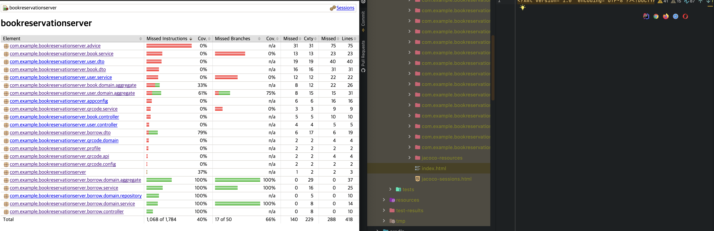

# 도입

테스팅이라는 것의 중요성을 알고 있었으나, 해야하는데 해야하는데 미뤄지는 숙제와도 같았다.

어떻게 테스팅을 해야하는지 고민도 많았고 개념도 많이 부족하였었다.

마침 지난 학기에 테스팅 관련 수업이 신설되었었고, 이를 들어보았다. 

테스팅에 관한 여러 개념들을 많이 배울 수 있었고 여러 유용한 점도 많이 알 수 있었다.

특히 커버리지라는 개념을 배우고 나서 토스 컨퍼런스인 slash 21에서 이 주제로 발표를 한 것을 보았다.

인스트럭션 커버리지 100% 기준을 달성하기 위해 여러 이슈들을 어떻게 해결했는지 알려주는 좋은 발표였다.

이후 더 찾아보고 이 테스트 커버리지는 현업에서 충분히 많이 사용되는 것으로 보였고 굉장히 효과적이라는 생각이 들었다.

또한 학교 프로젝트에서 서버를 구축하면서 매번 수동으로 swagger ui를 가지고 테스팅하는 것은 매우 비효율적이라고 생각이 들었다.

API의 반환타입이 바뀌거나 하면 또 매번 해줘야하며, session을 통해 구축하는 거면 로그인까지 해줘야하는 문제점이 있었다.

따라서 학교 프로젝트의 서버에 test code를 추가하여 Branch 기준으로 100% 달성하려고 한다.

이는 추후 몇가지 기능을 더 추가할 때 매우 큰 도움이 될 것이다.

어떻게 커버리지를 달성했는지 알 수 있는 jacoco 플러그인과 

컨트롤러, 리포지토리, 서비스, 도메인 등을 어떻게 테스트 코드를 작성했는지 포스팅해보겠다.

# 테스트 커버리지

---

> 테스트 케이스가 얼마나 코드를 커버하고 있는지 나타내는 지표

테스트 커버리지는 테스트가 어느정도 코드를 테스트하고 있는지 수치화하기 때문에, 

테스트를 언제 얼마만큼 작성해야하는지 기준이 된다는 큰 장점이 있다.

statement(line) coverage, decision(branch) coverage, condition/decision coverage, 
modified condition/decision coverage 등등 여러 커버리지가 있지만 이 중에 2가지만 알아보자.

## line coverage

> 코드의 각 라인이 한번이라도 실행되었는지 측정

테스트 케이스들이 모든 라인을 한번이라도 실행한다면, line coverage 100% 라고 할 수 있다.

예를 들어 설명해보면 아래의 경우 test case가 `num=11`이면 `#1, #2, #3` 모두 실행하게 되어

100% line coverage를 달성하게 된다.

```java
private void printNumber(int num){
    if(num > 10){ // #1 
        System.out.println("bigger than 10"); // #2
    } 
    System.out.println(num); // #3
}
```

## branch coverage

> 분기문(if-else, switch)의 조건식의 결과가 true, false를 한번이라도 충족했는지 측정.

테스트 케이스들이 모든 분기문들의 조건식의 결과가 true, false를 한번이라도 충족하게 한다면, 
branch coverage 100% 라고 할 수 있다.

위의 예제에서 `num=11`이라는 테스트 케이스는 `num > 10` 가 true인 경우만 만족시키므로,

branch coverage 100% 달성하기 위해서는 `num=11`, `num=10` 이렇게 2가지의 테스트 케이스가 필요하다.

참고로 `num1 > 10 && num2 > 5` 이런 조건식의 전체 결과가 true, false인지만 따지는게 branch coverage이며,

`num > 10`과 `num2 > 5` 각각 모두 true, false인지 따지는 것은 condition/decision coverage 나 

modified condition / decision coverage 등에서 수행한다.

이보다 더 강력한 multiple condition coverage, all path coverage 등이 있지만, 

이는 매우 강력한만큼 매우 많은 노력이 들기 때문에 충분히 효과적이면서 쉬운 line coverage나 branch coverage 등이 많이 쓰인다.

> 이번 프로젝트에서는 line coverage 100%를 달성해보려 한다.

# jacoco 설치

---

> jacoco는 java 코드의 커버리지를 측정하는 라이브러리로, html, csv, xml과 같은 형태로 리포트(측정 결과)를 생성해준다.

이 jacoco 플러그인을 통해 테스트 커버리지 측정을 해볼 것이다.

`build.gradle`에서 추가하면 된다.

`build.gradle`에서 `plugins` 부분에 아래와 같이 추가한다.

```
plugins {
    ...
    id 'jacoco' // 추가
}
```

그리고 test 커버리지 측정 리포트 설정은 다음과 같이 한다.

```
jacocoTestReport{
   reports{
       html.enabled true // html 형식으로 볼 수 있다.
       xml.enabled false
       csv.enabled false
   }
   
   // 아래 afterEvaluate 부분은 리포트를 보여줄 때, 제외하고 싶은 것을 의미한다.
   // 현재 프로젝트에서 QueryDSL과 룸북의 Builder 어노테이션이 만들어주는 코드를 
   // 테스트하는 것은 의미없으므로 제외해준다. 
    afterEvaluate {
        classDirectories.setFrom(files(classDirectories.files.collect{
            fileTree(dir: it, excludes: [
                    '**/aggregate/Q*', // QueryDSL이 생성하는 엔티티를 제외한다.
                    '**/*Builder*' // 룸북을 통해 생성된 빌더를 제외한다.
            ])
        }))
    }

    finalizedBy 'jacocoTestCoverageVerification' // 작업 후 여기 있는 task를 실행한다. 
}
```


그리고 아래는 어떤 커버리지를 얼마만큼 달성할 것인지 나타내는 부분이다. 이를 추가해주자.

```
jacocoTestCoverageVerification{
    violationRules{
        rule{
            element = 'CLASS'
            // 위에서 제외해준 겉은 리포트를 표시할 때만 안보여주는 것이므로, 위에서 제외했어도 검증은 하게 된다.
            // 검증도 안하려면 다음과 같이 작성해주자.
            excludes = [
                    '**.aggregate.Q*',
                    '**.*Builder*',
            ]
            limit{
                counter = 'LINE' // 라인 기준이며, 이 외에도 BRANCH, CLASS, METHOD, INSTRUCTION이 있다.
                value = 'COVEREDRATIO' // 리포트의 커버리지 달성 정도를 %로 표기.
                minimum = 1.00 // 최소 커버리지 달성 요구 조건. 여기서는 100%를 의미.
            }
        }
    }
}
```

그리고 마지막으로 test task를 다음과 같이 작성해준다.

```
test {
    useJUnitPlatform()
    finalizedBy 'jacocoTestReport'
}
```

이렇게 되면 test task를 수행하면 `test` -> `jacocoTestReport` -> `jacocoTestCoverageVerification` 
순으로 진행된다.

이렇게 작성한 후 `./gradlew test`를 실행시키면 다음과 같은 화면을 볼 수 있다.


`jacocoTestCoverageVerification` task가 실패했음을 볼 수 있으며 각 부분이 얼마만큼 달성했는지 보여준다.

좀 더 쉽게 눈으로 확인할 수 있는데 `build/reports/jacoco/test/html/index.html`를 통해 확인 할 수 있다.

intellij 를 이용하면 옆에 뜨는 웹브라우저 아이콘을 클릭해서 볼 수 있다.



이렇게 한눈에 얼마만큼 달성했는지 볼 수 있다. 

포스팅을 하기 전 borrow 패키지는 라인 기준으로 100% 달성하도록 테스트 케이스를 작성했었다.

그에 따라 초록색 게이지가 꽉 찬 것을 볼 수 있다.

이제 어떻게 초록색 게이지를 모두 달성하는지 (라인 커버리지100% 달성) 경험을 써보겠다. 

# 기본 Rule

---

> 먼저 각 레이어별 테스트 전략을 쓰기 전에, test 작성 시 기본 패턴과 규칙을 알아보자

## given - when - then 패턴

> 아래는 하나의 테스트 함수를 작성할 때 다음과 같이 작성하는 것이다.

* given(준비): 어떠한 데이터가 준비되었을 때 (Mock 객체의 행동도 정의)
  
* when(실행): 어떠한 함수를 실행하면

* then(검증): 어떠한 결과가 나와야 한다.

이를 코드로 보면 다음과 같다.

```java
@Test
@DisplayName("이미 반납되었을 때 반납 실패")
public void testReturnFailedWhenAlreadyReturned(){
    //given
    final List<Borrow> returnedList = returnedList();
    doReturn(returnedList).when(borrowRepository).findBorrowsByBookId(isA(Long.class));

    //when
    IllegalArgumentException exception = assertThrows(IllegalArgumentException.class,()->returnService.returnBook(1L));

    //then
    assertEquals(exception.getMessage(), "이미 반납되었습니다.");
}
```

내부의 좀 더 자세한 내용은 아래에서 포스팅 하겠다.


## FIRST 규칙

> 클린 코드 책의 깨끗한 테스트코드 5가지 규칙을 의미하며, 앞 글자를 따서 FIRST라고 한다. 

1. Fast: 테스트는 빠르게 동작하여 자주 돌릴 수 있어야 한다.

   * 스프링의 모든 빈을 올려놓고 하는 테스트는 꼭 필요할 때만 하자.
    
   * Mockito 라이브러리를 적극적으로 이용하자.
    
   * 토스에서는 Mockito의 Mock 객체 생성시간까지 줄일 수 있도록 직접 Mock을 구현하였다. 
   
2. Independent: 각각의 테스트는 독립적이며 서로 의존해서는 안된다. 

   * 데이터는 각 테스트마다 공유되지 않도록 하자.
     
   * 테스트의 순서가 매번 달라질 수 있는데 순서에 따라 실패하지 않도록 하자.
   
3. Repeatable: 어느 환경에서도 반복 가능해야 한다.

   * 테스트 환경을 구축해놓고 테스트를 작성하자.

   * 리포지터리 테스트 시에는 `@DataJpaTest` 어노테이션을 사용해주자.
     `@Transactional` 어노테이션을 포함하고 있어 테스트가 끝나면 롤백을 시켜준다.
     
4. Self-Validating: 테스트는 성공 또는 실패로 bool 값으로 결과를 내어 자체적으로 검증되어야 한다.

   * Assertions의 assert 함수들을 `then`에서 호출하자.
   
5. Timely: 테스트는 적시에 즉, 테스트하려는 실제 코드를 구현하기 직전에 구현해야 한다

   * 이번에는 이미 코드 구현이 되어있어 만족하지 못하였다.
   
   * 추후 새로운 기능을 추가시에, TDD로 개발한다면 자동으로 만족할 것이다.

# Mock

> 테스트하려는 클래스가 다른 특정 클래스에 의존하고 있을 때, 의존하는 클래스를 직접 사용하는 것이 아니라,
> 미리 지정한 행동을 하는 가짜 객체로 대체하여 사용한다.
> 이 때 사용한 가짜 객체를 Mock 객체라고 한다.

우리는 Mockito library를 통해 쉽게 Mock 객체를 구현할 것이다.

몇 가지 사용법을 알아보자.

## @InjectMocks, @Mock

아래처럼 작성하면 `UserRepository`의 Mock 객체를 `UserService`에 주입시켜준다.

```java
class TestClass{
    @InjectMocks
    private UserService userService;
    
    @Mock
    private UserRepository userRepository;
}
```

## stubbing

> 어떤 메서드를 호출했을 때 미리 준비된 객체를 반환하는 것.

```java
doReturn(List.of(new User("honggildong"))).when(userRepository).getUsers();
```

`userRepository`의 `getUsers()` 함수를 호출하면 이름이 'honggildong'인 유저가 한명 있는 리스트가 반환된다.


# 각 레이어별 테스트 전략

## 프리젠테이션(컨트롤러)

여기서 한 번 컨트롤러의 역할에 대해 생각해보자.

> 프리젠테이션 계층(컨트롤러) 는 사용자의 요청을 받아 응용 영역에 전달하고 
> 응용 영역의 처리 결과를 사용자에게 전달하는 역할을 한다.

즉 프리젠테이션에서 주의해서 테스트 해야하는 것은 다음과 같이 생각할 수 있다.

1. 사용자의 요청을 정확하게 받았는지

2. 서비스 계층에 잘 전달해줬는지

3. 서비스 계층의 처리 결과를 사용자에게 잘 전달했는지

따라서 여기서 컨트롤러가 의존하고 있는 서비스들을 Mock 객체로 구현하여도 무방하다고 볼 수 있다.

또 Mock을 사용함으로 스프링 컨테이너를 사용하지 않으므로 `FIRST`의 `Fast` 또한 충족할 수 있다.

테스트하려는 컨트롤러는 다음과 같다. `borrow(borrowRequest)`메서드를 테스트해보자.

```java
@RestController
@RequiredArgsConstructor
public class BorrowController {
    private final BorrowService borrowService;
    
    ...

    @PostMapping(value = "/api/borrow", produces = "application/json; charset=utf8")
    public Borrow borrow(@RequestBody @Valid BorrowRequest borrowRequest){
       return borrowService.borrowBook(borrowRequest);
    }
    
   ...
}
```


테스트 코드는 다음과 같이 작성하자.

```java
@ExtendWith(MockitoExtension.class) // junit5에서 Mockito library 사용하기 위해 추가해줘야함.
class BorrowControllerTest{
   @InjectMocks // Mock 객체들을 주입
   private BorrowController borrowController;

   @Mock // Mock 객체
   private BorrowService borrowService;
   
   ...

   private MockMvc mockMvc; // MockMvc를 통해 API 요청을 할 수 있도록, Spring test에서 이를 제공.

   private Gson gson; // json 파싱을 위해 사용.

   @BeforeEach // 매 테스트가 시작되기 전 실행됨.
   public void init(){
      mockMvc = MockMvcBuilders.standaloneSetup(borrowController).build();
      gson = new Gson();
   }

   @Test
   @DisplayName("대여하기 성공") // 화면에 표시되는 문구.
   void testBorrowSuccess() throws Exception {
      //given
      final BorrowRequest borrowRequestDto = BorrowRequest.builder()
              .borrowerId(1L).borrowerName("hongildong").bookId(2L).build();
      final Borrow borrow = Borrow.builder().state(BorrowState.BORROWING).build();

      doReturn(borrow).when(borrowService).borrowBook(argThat(b -> b.getBorrowerId() == 1));

      //when
      final ResultActions resultActions = mockMvc.perform(
              MockMvcRequestBuilders.post("/api/borrow")
                      .contentType(MediaType.APPLICATION_JSON)
                      .content(gson.toJson(borrowRequestDto))
      );

      //then
      final MvcResult mvcResult = resultActions.andExpect(status().isOk()).andReturn();
      assertEquals(mvcResult.getResponse().getStatus(), 200);
      final Borrow response = gson.fromJson(mvcResult.getResponse().getContentAsString(), Borrow.class);
      assertEquals(response.getState(), BorrowState.BORROWING);
   }
   
   ...
}
```

`testBorrowSuccess()`의 `given-when-then`으로 나눠서 살펴보자.

### given

먼저 요청을 하기위한 Dto인 `BorrowRequest`와 `BorrowService`의 반환값으로 `borrow`를 준비하였다.

그리고 컨트롤러가 서비스에게 제대로 데이터를 넘겼는지 확인하기 위해 `argThat(b -> b.getBorrowId == 1)`을 통해서 
해당 값에 일치하는 요청이 들어왔을 때만 값을 반환하도록 하였다.

### when

`MockMVC`를 통해 API 요청을 수행하였다. `/api/borrow` URL로 POST 요청을 하였으며, 타입은 JSON
그리고 미리 생성한 요청 Dto 객체를 `Gson`을 이용해 json으로 만들어 보내었다.

### then

결과를 검증하는 단계로, 호출한 API의 status code가 200인지 확인하였고

정상적으로 데이터를 받았는지 검증하였다.

테스트를 돌려보면 다음과 같이 결과가 나온다.


## 응용 계층 서비스

응용 계층의 경우도 프리젠테이션 계층(컨트롤러) 와 비슷하게 테스트하였다.

의존하는 Repository를 Mock 객체로 하고 Stubbing을 해주었다.

아래는 테스트하려는 서비스이다.

```java
@Service
@Slf4j
@RequiredArgsConstructor
public class BorrowSearchService {
    private final BorrowRepository borrowRepository;
    private final UserRepository userRepository;

    ...
    
    // below is for one user
    @Transactional
    public List<BorrowBookResponse> getMyBorrowings(Long userId){
        checkUserExist(userId);
        return borrowRepository.findBorrowbookAllByBorrower_UserIdAndState(userId, BorrowState.BORROWING);
    }

    ...

    private void checkUserExist(Long userId){
        if(!userRepository.existsById(userId)) 
            throw new IllegalArgumentException("해당 유저가 없습니다.");
    }
}
```

컨트롤러의 예제와는 다르게 실패하는 경우에 대해 작성해보자.

```java
@ExtendWith(MockitoExtension.class)
class BorrowSearchServiceTest {

   @InjectMocks
   private BorrowSearchService borrowSearchService;

   @Mock
   private BorrowRepository borrowRepository;
   @Mock
   private UserRepository userRepository;
    
    ...

   @Test
   @DisplayName("유저의 현재 대여중인 목록 가져오기 실패")
   public void testGetOneUserBorrowingsFailed() {
      // given
      doReturn(false).when(userRepository).existsById(-1L);

      // when
      final IllegalArgumentException exception = assertThrows(IllegalArgumentException.class
              , () -> borrowSearchService.getMyBorrowings(-1L));

      // then
      assertEquals(exception.getMessage(), "해당 유저가 없습니다.");
   }
   ...
}
```

`BorrowSerchService`의 `getMyBorrowings(int)` 함수를 호출하면 해당 사용자의 대여중인 목록을 반환해준다.

그런데 해당 사용자가 없으면 실패하게 되어있는데, 이 경우를 `given-when-then`으로 알아보자.

### given

`userRepository`의 exsistsById()가 호출되면 false를 반환하게 된다.

이렇게 하면 실패하여 예외를 던지게 될 것이다.

### when

실제 함수를 호출하고 `IllegalArgumentException` 타입으로 exception을 반환받는다.

### then

예외의 메시지가 `해당 유저가 없습니다.` 와 일치하는지 확인해본다.


## 도메인 (엔티티)

> 도메인 엔티티는 도메인 로직을 책임진다.

테스트하려는 엔티티의 코드는 다음과 같다.

```java
public class Borrow {

   ...
   
   @Enumerated(EnumType.STRING)
   private BorrowState state;

   @Column(name = "expired_at")
   private LocalDate expiredAt;
   
   ...

   public void expired() {
      if (state == BorrowState.RETURNED) throw new IllegalStateException("이미 반납이 완료되었습니다.");
      if (LocalDate.now().isBefore(expiredAt)) throw new IllegalStateException("아직 연체 기간이 남았습니다.");
      state = BorrowState.EXPIRED;
   }
   ...
} 
```

여기서 연체로 변경한 것을 성공했는지 테스트해보자.

```java
class BorrowTest {

   @Test
   @DisplayName("연체로 변경 성공")
   public void testSetExpiredSuccess() {
      //given
      Borrow borrow = Borrow.builder().state(BorrowState.BORROWIN)
              .expiredAt(LocalDate.now().minusDays(1)).build();

      //when
      borrow.expired();

      //then
      assertEquals(borrow.getState(), BorrowState.EXPIRED);
   }
   
   ...
}
```


여기서 연체로 바꾼 뒤, 상태가 `EXPIRED`로 바뀌었는지 확인하고 있다.

### given

`BORROWING` 상태의 `Borrow` 객체를 생성하고 만료시간을 현재보다 하루 전으로 설정한다.

### when

`expired()` 함수를 호출한다.

### then

엔티티의 state가 `EXPIRED`로 바뀌었는지 확인한다.


> 커버리지를 100% 달성하기 위해서 예외들이 발생하는 테스트 케이스들도 작성해주자.

## 도메인 (리포지터리)

리포지터리 테스트는 위에서 봤던 것들이랑 좀 다른 점이 있다.

1. 리포지터리를 Spring Data JPA를 사용하고 있는데, Spring Data JPA가 만들어주는 메서드에 대해서는 테스트 할 필요가 없다.
   그 이유는 이미 충분히 검증되어 사용되고 있는 라이브러리이기 때문에 굳이 테스트 할 필요가 없기 때문이다.
   테스트할 부분은 N+1 문제를 해결하기 위해 집적 QueryDSL을 작성한 부분이다.
   
2. 리포지터리의 경우 실제 데이터가 생성되었는지 삭제되었는지 확인할 필요가 있다. 따라서 테스트용 디비 환경 구축을 할 필요가 있다.


먼저 환경 구축부터 해보자.

### 테스트용 디비 환경 구축

아래 내용을 `build.gradle`에 추가해주자.

```
dependencies{
   ...
   testImplementation 'com.h2database:h2' // test시에만 작동
}
```

그리고 아래 내용을 `application.yaml`에 추가해주자.

```yaml
---
spring:
  config:
    activate:
      on-profile: test
  datasource:
    url: jdbc:h2:mem:testdb
    platform: h2
    username: sa
    password:
    initialization-mode: always
  jpa:
    database: h2
    show-sql: true
    hibernate:
      ddl-auto: create
    generate-ddl: true
    database-platform: org.hibernate.dialect.H2Dialect
  h2:
    console:
      enabled: true
```

이렇게 설치하면 프로필을 `test`로 했을 때만 이 설정을 사용하게 된다.

### 테스트 케이스

테스트하려는 코드는 다음과 같다.

```java
@RequiredArgsConstructor
public class BorrowRepositoryImpl implements BorrowRepositoryCustom {
   private final JPAQueryFactory queryFactory;

   @Override
   public List<BorrowBookResponse> findBorrowbookAllByState(BorrowState state) {
      return find(borrow.state.eq(state));
   }
   
   ...

   private List<BorrowBookResponse> find(Predicate predicate) {
      return queryFactory
              .select(Projections.constructor(BorrowBookResponse.class,
                      borrow.id,
                      borrow.state,
                      borrow.createdAt,
                      borrow.expiredAt,
                      borrow.borrower.userId,
                      borrow.borrower.userName,
                      book
              )).from(borrow)
              .join(book).on(borrow.bookId.eq(book.book_id))
              .where(predicate)
              .fetch();
   }
}
```

위 함수는 `Borrow`를 `State`를 조건으로 검색하고, `Book`과 join하여 반환한다.

실제 `BorrowRepositoryImpl`를 사용할 것은 아니고, `BorrowRepository` 인터페이스를 통해 테스트 할 것이다.

테스트 코드는 다음과 같다.

```java
@ExtendWith(SpringExtension.class)
@DataJpaTest // JPA와 관련된 객체들만 로딩, 테스트가 끝나면 자동으로 롤백
@Import(TestConfig.class) // QueryDSL 사용에 필요한 빈을 생성하기 위해서 Configuration import
@ActiveProfiles("test") // test db 환경인 H2를 사용하기 위한 것
class BorrowRepositoryTest {
   @Autowired
   private BorrowRepository borrowRepository;

   @Autowired
   private BookRepository bookRepository;

   @Test
   @DisplayName("상태로 대여-책 검색 성공")
   public void testFindByStateSuccess(){
      //given

      //when
      List<BorrowBookResponse> borrowBookList1 = borrowRepository.findBorrowbookAllByState(BorrowState.BORROWING);
      List<BorrowBookResponse> borrowBookList2 = borrowRepository.findBorrowbookAllByState(BorrowState.EXPIRED);
      List<BorrowBookResponse> borrowBookList3 = borrowRepository.findBorrowbookAllByState(BorrowState.RETURNED);

      //then
      assertEquals(borrowBookList1.size(), 2);
      assertEquals(borrowBookList2.size(), 2);
      assertEquals(borrowBookList3.size(), 2);
   }
   
   ...

   @BeforeEach // 테스트 메서드를 실행하기 전 수행
   public void setUp(){
      List<Book> bookList = bookList();
      bookRepository.saveAll(bookList);
      borrowRepository.saveAll(borrowList(bookList));
   }

   @AfterEach // 테스트 메서드가 수행하고 난 다음 수행
   public void tearDown(){
      borrowRepository.deleteAll();
      bookRepository.deleteAll();
   }

   // 책 데이터
   public List<Book> bookList(){
      return List.of(
              Book.builder().book_name("name1").build(),
              Book.builder().book_name("name2").build(),
              Book.builder().book_name("name3").build(),
              Book.builder().book_name("name4").build(),
              Book.builder().book_name("name5").build(),
              Book.builder().book_name("name6").build()
      );
   }

   // Borrow 데이터
   public List<Borrow> borrowList(List<Book> books) { 
      return List.of(
              Borrow.builder().bookId(books.get(0).getBook_id()).state(BorrowState.BORROWING).createdAt(LocalDate.now())
                      .expiredAt(LocalDate.now().plusDays(7)).borrower(new Borrower(1L, "hong")).build(),
              Borrow.builder().bookId(books.get(1).getBook_id()).state(BorrowState.BORROWING).createdAt(LocalDate.now())
                      .expiredAt(LocalDate.now().plusDays(7)).borrower(new Borrower(1L, "hong")).build(),

              Borrow.builder().bookId(books.get(2).getBook_id()).state(BorrowState.EXPIRED).createdAt(LocalDate.now())
                      .expiredAt(LocalDate.now().plusDays(7)).borrower(new Borrower(1L, "hong")).build(),
              Borrow.builder().bookId(books.get(3).getBook_id()).state(BorrowState.EXPIRED).createdAt(LocalDate.now())
                      .expiredAt(LocalDate.now().plusDays(7)).borrower(new Borrower(2L, "kim")).build(),

              Borrow.builder().bookId(books.get(4).getBook_id()).state(BorrowState.RETURNED).createdAt(LocalDate.now())
                      .expiredAt(LocalDate.now().plusDays(7)).borrower(new Borrower(2L, "kim")).build(),
              Borrow.builder().bookId(books.get(5).getBook_id()).state(BorrowState.RETURNED).createdAt(LocalDate.now())
                      .expiredAt(LocalDate.now().plusDays(7)).borrower(new Borrower(2L, "kim")).build()
      );
   }
}
```

조금 복잡해보이지만 차근 차근 알아보자.

먼저 다른 테스트 함수들에서도 Book 객체들와 Borrow 객체들을 사용하므로 따로 공통 메서드로 만들어 두었다.

그리고 테스트를 하기 전 데이터를 넣어넣고, 테스트가 수행하고 나서 데이터를 삭제하였다.
이는 `FIRST`의 `Independent`를 만족할 수 있다.

이제 given - when - then을 살펴보자.

#### given

`setUp` 함수를 통해 미리 데이터를 디비에 넣어놨으므로, 수행할게 없다.

#### when

`BORROWING`, `EXPIRED`, `RETURNED` 상태로 각각 데이터를 가져온다.

#### then

가져온 데이터들의 갯수들의 수가 맞는지 확인한다.


## 글을 마치며

테스트를 작성해야한다는 생각은 있었으나 얼마만큼 테스트를 해야하고, 어떻게 시작해야할지 고민이 많았었다.

테스트 커버리지라는 내용을 알고 나서 라인 커버리지를 100% 달성하자라는 목표로 하다보니 테스트가 즐거워진 것 같다.

현재는 borrow 패키지만 100% 달성하였으나, 조금씩 시간을 투자하여 모두 100%를 달성할 수 있도록 해야겠다.


# 참조

* 토스 SLASH 21

* https://mangkyu.tistory.com/144

* https://github.com/cheese10yun/spring-guide/blob/master/docs/test-guide.md


