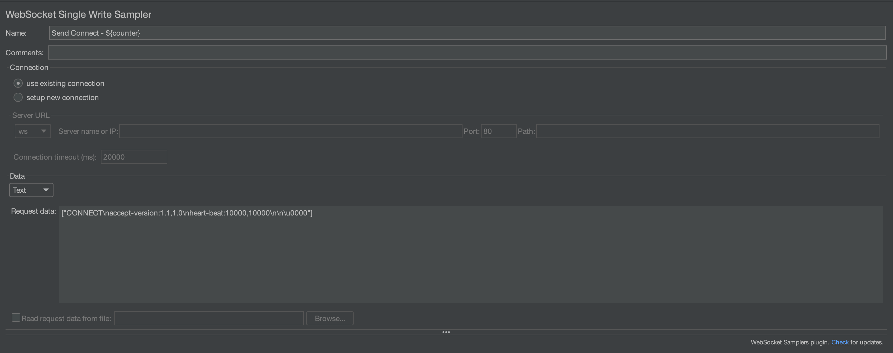
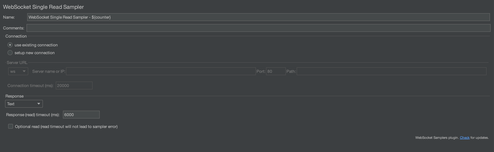
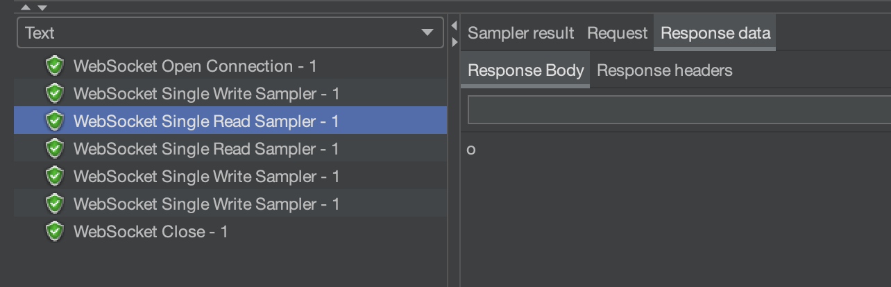

# 도입

학교에서 했던 프로젝트에서 STOMP Protocol을 활용해 메시징 서비스를 만들었었다.

몇 가지 개선하고 싶은 점이 있었는데, 제일 개선하고 싶었던 점은 메시지 솔루션의 성능을 높이는 것이다.

트래픽이 몰렸을 때, 어떤 상황이 일어나는지 살펴보고 이를 개선해보고자 한다.

이번 포스팅은 2개로 나누어 진행하고자 한다.

# 문제점 파악

> STOMP Protocol은 Websocket의 서브 프로토콜로 PUB/SUB 구조를 가진다.

당시 단체 채팅방의 기능을 구현해야했기 때문에 Stomp 프로토콜을 이용하는 것이 더 쉽게 개발할 수 있을거라 판단하여 도입하였다.

## 현재 서버의 Stomp Protocol 동작 흐름


1. Websocket 커넥션에서 전송받은 메시지를 스프링의 `Message` 형태로 변환한다.

2. `Message`는 2가지로 분기할 수 있다. 바로 `SimpleBroker`로 전달되거나, 
   `@MessageMapping` 매핑된 메서드에게 전달하고, 이후 브로커 채널을 통해 `SimpleBroker`로 전달된다.

위 방식은 스프링의 In memory를 사용하는 `SimpleBroker` 방식이다.

이 방식을 현재 우리 프로젝트에서 사용하고 있다.

## 개선방안 도출과정

`SimpleBroker` 대신 외부 브로커(`RabbitMQ` 등)를 사용할 수 있는데, 아래의 `SimpleBroker`의 문제점을 해결할 수 있다.

1. 세션을 수용할 수 있는 크기가 제한되어 있다.

2. 장애 발생 시 메시지 유실될 수 있다.

3. 모니터링 하기 어렵다.

특히 이 방식을 사용하면 Scale Out을 할 수 있기 때문에 트래픽에 유연하게 대처할 수 있다.

그래서 처음에는 아래와 같은 방식을 먼저 생각하고, 구현하려고 했다.


하지만 그림에서 보시다시피, 메시지가 오고 갈 때 데이터베이스에 저장하고 (`@Transactional`)
오프라인 유저를 찾아 `fcm server`를 통해 알림을 전송한다. 
이 부분들은 블로킹이 되는 부분이다.

특히 `fcm` 부분은 단체 채팅방에서 매우 나쁜 성능을 보인다.
그 이유는 `fcm server`로 메시지를 보낸 후, 다시 응답받기까지 시간이 걸리기 때문이다.

아래 그림처럼 여러 명에게 알림을 보낼 경우, `fcm server`와 여러번 데이터를 주고 받아야하며
이 작업이 끝나기 전까지 해당 쓰레드는 블로킹이 되는 문제가 생긴다.


비동기 방식으로 `fcm server`로 메시지를 전송할 수 있으나, 
`fcm server`로 잘 도착했는지 응답을 받으려면 `get` 함수를 호출해야한다.
이 함수를 호출하면 블로킹된다.

위에서 본 외부 브로커로 전환하려는 방법보다 먼저 블로킹이 되는 부분을 제거하는게 더 급선무라고 보았다.

따라서 구현하려는 아키텍처는 다음과 같다.


푸시 알림 기능과 데이터베이스 저장 기능을 새로운 스프링 서버로 분리하고, 메시지 정보를 `rabbitmq`를 통해 전달한다.

원래 서버는 채팅 기능과 `rabbitmq`로 전송하는 기능만 담당하기 때문에 블로킹이 적어지며, 응답속도가 좋아질 것이라 기대할 수 있다.

또한 앞에 `nginx`를 둔 이유는 트래픽을 조절할 수 있다는 점이다. 

스프링에서 많은 수의 요청이 도달하면 기본 지정해놓은 쓰레드 갯수 200개보다 많아 큐에 계속 쌓이게 되는데,
너무 많이 큐에 요청이 쌓이면 heap 메모리가 넘쳐 오류가 발생할 것이다.

`nginx`에서 일정 수의 커넥션만 유지하고, 이후 요청을 무시한다면 현재 접속중인 유저에게 더 안정적인 서비스를 제공할 수 있을 것이다.

이제 구현 및 성능 측정을 위해 `Stomp Frame` 형태, 측정 툴인 `jmeter`, `nginx` 적용 및 성능 측정 및 옵션 설정을 해보자.

기능 분리 전/후 성능 테스트는 다음 포스팅에서 해보겠다. 

# Stomp Frame

```
COMMAND
header1:value1
header2:value2

Body^@
```

위는 기본적인 Stomp Frame 형태이다.

* COMMAND : 메시지 액션(타입)을 정한다.

* header : `header1:value` 형태이며, 다음 `header`로 넘어갈 때 줄바꿈으로 구분한다.(`\n`)

* Body : body 시작전 `\n`을 넣어줘야하며, body 끝나는 지점에 null byte(`0x00`)을 넣어줘야한다. 
  * 문서에서는 보기 편하게 null byte를 `^@`로 표시한다고 한다.

* utf-8 로 인코딩된다고 한다

## Connecting

> Websocket이 연결된 후, 클라이언트는 다음과 같은 형태로 요청을 할 수 있다.

```
CONNECT
accept-version:1.2
host:stomp.github.org

^@
```

가능한 헤더

* accept-version : 클라이언트가 사용한 버전

* host : 클라이언트가 연결하려는 가상 호스트의 이름

* login : Secured Stomp Server와 연결하기 위한 사용자의 id

* passcode : Secured Stomp Server와 연결하기 위한 사용자의 비밀번호

* heart-beat : heart beat 세팅
  
  * client는 `heart-beat:cx,cy` 형태로 요청을 보낸다.

  * server는 `heart-beat:sx,sy` 형태로 응답을 보낸다.

  * x는 outgoing hear-beat, y는 incoming hear-beat이다.

  * heart-beat : cx,cy 형태로 세팅하며, Max(cx,sy) millesecond 마다  heart-beat를 주고 받아 상태를 체크한다.

정상적으로 연결이 되면 다음과 같은 메시지를 서버로부터 응답받는다.


```
CONNECTED
version:1.2

^@
```

연결이 된 후 클라이언트는 다음과 같은 요청들을 할 수 있다.

* SEND
* SUBSCRIBE 
* UNSUBSCRIBE 
* BEGIN 
* COMMIT 
* ABORT 
* ACK 
* NACK 
* DISCONNECT

`SEND`, `SUBSCRIBE`, `UNSUBSCRIBE`, `DISCONNECT`를 쓸 예정이므로 이를 알아보자.

> Stomp Protocol은  transcation을 지원하기 위해 BEGIN, COMMIT, ABORT 명령어를 지원한다.

## SEND Frame

> SEND 요청으로 해당 큐에 메시지를 보낼 수 있다.

```
SEND
destination:/queue/a
content-type:text/plain

hello queue a
^@
```

* destination : 보내려는 지점(큐)

* 위 예제의 경우, 전달되는 메시지는 바디인 hello queue a가 된다.

## SUBSCRIBE Frame

> Subscribe 요청으로 해당 큐를 구독하고, 메시지를 수신받을 수 있다.

```
SUBSCRIBE
id:0
destination:/queue/foo
ack:client

^@
```

* id : 무조건 포함시켜야 하는 헤더로, 클라이언트가 구독한 큐가 여러개일 때 이를 구분하기 위한 id이다.

* destination : 구독하려는 큐의 이름

* ack : auto(default), client, client-individual 3가지 옵션이 있다. 

  * auto : 클라이언트는 메시지를 받고 ACK Frame을 보낼 필요가 없다.

  * client :  클라이언트는 메시지를 받고 ACK Frame을 보내야한다. 

  * client-individual : 클라이언트가 보내는 ACK, NACK이 쌓이지 않는다.

## UNSUBSCRIBE Frame

> 이 요청으로 해당되는 id의 큐를 구독 취소할 수 있다. 더 이상 그 큐의 메시지를 수신받지 않게 된다.

```
UNSUBSCRIBE
id:0

^@
```

## DISCONNECT Frame 

> 이 요청으로 서버와 연결을 끊을 수 있다.

> websocket을 닫음으로 연결을 끊을 수도 있지만, 
> 이전에 보낸 메시지를 서버가 아직 받지 않을 수도 있다. 
> 이 명령어를 이용하면 서버가 메시지를 모두 수신한 후 연결이 끊어지게 된다.

```
DISCONNECT
receipt:77
^@
```

모두 정상적으로 처리되면 서버로부터 아래 메시지를 응답받는다.

```
RECEIPT
receipt-id:77
^@
```

# jmeter

이제 어떻게 테스트 했는지 알아보자. 부하 테스트 툴로 `jmeter`를 선택했다.

`jmeter`에는 stomp protocol을 지원하는 플러그인이 있었으나, 
`CONNECT`와 `SUBSCRIBE`라는 제한적인 기능만 제공해서 `websocket`을 이용해 직접 해보려고 한다.

먼저 할 테스트는 `nginx`로 몇명을 수용할 수 있는지 테스트하기 위해서 다음의 과정으로 실험한다.

1) websocket 연결


 
2) CONNECT



3,4) websocket 으로 response 읽어오기



5) SUBSCRIBE


6) DISCONNECT


7) websocket close


전체적인 플랜은 다음과 같다.


* Summary Report를 통해 전체 쓰레드(유저)가 수행한 결과의 평균치를 report 받는다.

* View Results Tree를 통해 어떻게 수행되었는지 하나하나 살펴 볼수 있다.

이제 Thread Group 설정에서 thread 갯수(유저)를 1로 두고 실행해보자.

수행된 후, View Result Tree 에서 다음과 같은 결과를 받을 수 있다.




정상적으로 수행된 것을 볼 수 있다.

# nginx 도입

앞서 말했듯이, `nginx`를 도입한 이유는 이미 접속중인 유저에게 안정적인 서비스를 제공하는게 더 중요하다고 판단했기 때문이다.

과연 얼마나 버틸 수 있을지, `nginx`를 거쳐서 서비스를 제공받는 것과 거치지 않고 스프링 서버에서 바로 서비스를 제공받는 걸 비교해보자.


## 100명 

먼저, 아래는 `nginx`를 거치지 않은 결과다.


평균 9ms로 매우 준수하다.

아래는 `nginx`를 거친 결과다.


평균 10ms로 매우 준수하다.

약 5번정도 테스트해보았을 때, 둘 다 거의 동일한 average를 보여주었다.

## 1000명

아래는 `nginx`를 거치지 않은 결과다.


총 5번의 테스트를 하였으며, average time이 72, 75, 85, 84, 72로 나왔다.

아래는 `nginx`를 거친 결과다.


총 5번의 결과는 89, 87, 82, 95, 86 이며, 에러율이 27.5% ~ 35% 사이였다.

생각보다 에러율이 높다. `nginx` 설정을 worker 1개에 connection 수 1024로 해놓았기 때문에

1000 가까이 나올 것 같았는데 좀 더 테스트 해보자.

## 3000명

아래는 `nginx`를 거치지 않은 결과이다.


총 5번의 결과는 694, 713, 603, 501, 592이다. 

이 때부터 에러율이 0 이상이 발생했는데, 0% ~ 26% 사이였다.

아래는 `nginx`를 거친 결과이다.


에러율이 약 70%정도 된다. 2000명이 넘는 사람이 서비스를 제공받지 못했다.

## 5000명

이제부터는 `nginx`를 거친 결과를 확인하는 것은 의미없다고 보았고, 거치지 않았을 때의 결과를 확인해보았다.


아래는 서버 로그이다.


역시 heap space가 가득차서 memeory가 부족했다. 이는 큐에 대기하는 요청이 많아져서 메모리가 넘친것으로 보인다.

스프링 서버 1대가 현재 수용할 수 있는 사람 수는 2000~3000명 정도이다. 

물론 `CONNECT`과 `SUBSCRIBE`만 한 결과이기 때문에, 하나의 작업이 수행하는 시간이 더 길어진다면 더 적은 수를 수용할 수 있을 것이다.

이를 보고 더더욱, 블로킹되는 부분을 최소화해야겠다고 생각이 들었다.

## nginx를 수용가능한 접속자 수 확인

먼저 아래는 500명 결과이다.

 

500명까지는 충분히 수용이 가능하다.

아래는 700명 결과이다.


11.14% 실패율이다. 몇 번 더 측정해보았는데 7.29%, 6%, 10.14%, 13.29% 실패율이 나왔다.

아무리 안정적으로 서비스를 제공해야한다지만, 동시에 접속 가능한 사람의 수가 700명이 안되는 것은 너무 적은 듯하다.

스프링 단독으로 써도 느리지만 2000명 이상 수용가능한데 이는 낭비가 아닐 수 없다.

`nginx` 설정을 좀 만져보자!

# nginx 옵션 설정

## 시도 1. keep alive timeout 설정

기본으로 세팅되어 있는 `nginx` 설정에서 `keepalive_timeout` 65로 설정이 되있었다.

이는 한 클라이언트가 서비스를 제공받은 후, 65ms 동안 새로운 클라이언트와 커넥션을 맺지 못한다는 의미이다.

이를 0으로 바꾸면 어떻게 될까 궁금했고, 실험해보았다.

하지만 결과는 동일했다.


7% ~ 13%로 에러율이 동일했다. 

아마 http로 커넥션을 맺은 후, 프로토콜을 전환하기 때문에 영향이 없는 것 같다.

마찬가지로 서버와의 커넥션 수 유지하는 설정인 `keepalive`를 설정해도 동일한 결과가 나왔다.

## 시도 2. worker의 connection 수 늘리기

위에서 한 설정은 실패했지만 connection 수 자체를 늘리면 근본적인 해결책이 될 것 같다.
`worker_connections`를 4096으로 늘려보자. 

1000명은 0% 에러율을 달성하였다.


하지만 예상과 다르게 3000명 테스트를 하였을 때, 약 30% 정도 에러율이 발생하였다.


아무래도 `nginx`와 `spring`이 같은 ec2 인스턴스에 올라가 있기 때문에 그런 것 같다.


실제로 `nginx`로 바로 보낼 때는 약 30% 정도, 바로 스프링 서버로 보낼 때는 평균 15% 에러를 보이는 것으로 보아 

`nginx`가 사용하는 메모리 때문에 요청이 누락되는 것으로 보인다.

# 글을 마치며

메시지 서비스를 개선하기 위해 `STOMP Protocol`을 공부하고, 이를 `Jmeter`로 적용하는 방법을 연구하여 테스트를 해보았으나
생각보다 낮은 성능을 보고 많은 아쉬움이 들었다.

메모리를 큰 인스턴스를 사용하고 스프링의 heap 메모리 설정을 크게 잡으면 더욱 많은 사용자를 수용할 수 있겠으나
현재 AWS의 프리티어를 사용하고 있으니, 어쩔 수 없는 아쉬움이 든다.

그래도 2000명의 사람은 충분히 수용할 수 있다는 것을 알았으니, 
2000명으로 트래픽을 제한할 수 있는 `nginx` 설정을 했다는 점에서 만족해야겠다.

다음 포스팅에서는 나머지 1개의 인스턴스에 `FCM` 푸시 알림과 데이터베이스에 저장하는 기능을 분리하고 `rabbitmq`를 설정한 후,
이를 설정하지 않았을 때와 Stomp의 `SEND`를 통해 성능 테스트를 해보려고 한다.

이후에 가능하다면, 동시 접속자 수를 늘려보려고 한다.

[실시간 댓글 개발기(part.3) – Spring의 동시성 접근 제어에 발목 잡힌 이야기](https://tech.kakao.com/2020/06/22/websocket-part3/) 를 보니 `SimpleBroker`를 사용할 경우,
사용자 수가 많아질수록 구독 정보를 가져오는 Cache 에서 Block 현상이 심하게 나타나는 거 같다.

카카오 블로그에서 적용한 방식을 사용하면 아무래도 블락되는 현상이 줄어들어 전체적으로 큐에서 대기하는 시간이 줄어들 것으로 예상된다.

이 방법을 적용하거나, 아니면 외부 브로커(`RabbitMQ`)를 사용하는 방법 둘 다 고려해보아야겠다.
