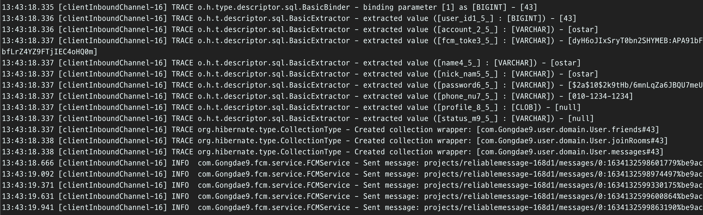
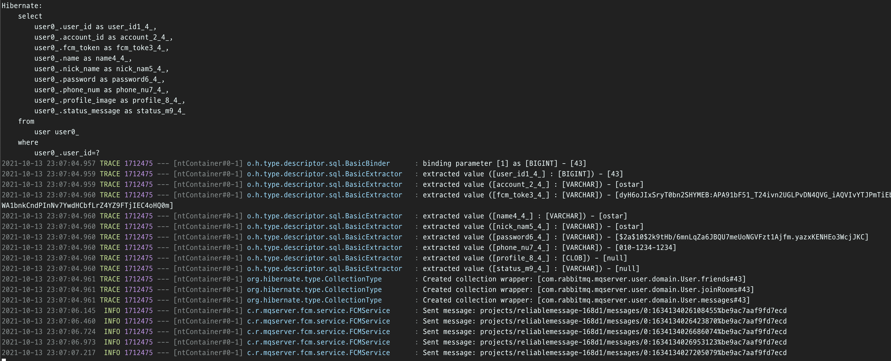

# 도입

저번 포스팅에서는 메시지 서비스의 부하 테스트를 위해 `Stomp Frame`의 형태와
`jmeter`를 이용한 테스트 방법을 알아보고, `nginx`를 적용할 때와 안 할때를 나누어 측정하였다.

이번에는 블로킹되는 부분인 `fcm` 기능과 `데이터베이스 저장/조회`를 다른 서버로 분리한 후,
`rabbitmq`를 통해 전달하는 리팩토링을 거치려고 한다.

아래는 새로 구축하려는 아키텍처이다.

그리고 전/후 성능 비교를 `jmeter`를 통해 측정하려 한다.
그 후, 추가 개선할 점이 있으면 개선해보는 과정을 거쳐보려 한다.

먼저 테스트를 위한 `jmeter` test plan 을 보자

# jmeter setup

> 저번과 크게 달라진 점은 SEND와 UNSUBSCRIBE가 들어간 것이다.

> 테스트하려는 방에는 6명의 인원이 있으며, 그 중 1명이 전송하도록 플랜을 구성했다.

전체적인 플랜은 아래와 같다.

`SEND`는 다음과 같다.

`UNSUBSCRIBE`는 다음과 같다.

* `SUBSCRIBE`에서 지정한 `id`와 동일한 값을 `id`에 적어주면 된다.

그리고 테스트를 해보자.

메시지를 보낸 후, 서버로부터 다시 받은 것 까지 확인할 수 있다.

서버 로그를 보면 `fcm`으로 메시지까지 잘 전송 된 것을 볼 수 있다.

# 기존 서버

> 기존 서버를 30명, 100명, 1000명, 2000명으로 테스트 해보자.

## 30명

아래는 30명을 테스트한 것이다.

평균 279ms 정도 시간이 걸린다. 에러율은 `READ`에서 5.56% 발생하였다.

## 에러

### Read Error

그 이유는 아래의 그림에서 원인을 찾을 수 있다.

설정한 `read timeout` 6000ms 동안 응답을 받지 못했기 때문에 에러가 발생했다.
한번에 여러 가상 유저가 한 명당 10개씩 요청을 하다보니, 그 요청들에 밀려 `READ`가 누락되는 경우가 생기는 것 같다.
20000ms로 설정할 경우 `READ` error는 사라진다. 

실제로는 유저가 앱에 접속해 있는 동안 `SUBSCRIBE` 상태를 유지하고, 
`UNSUBSCRIBE` 되기 전까지 메시지를 기다리고 받고 하기 때문에,
느리게 받을 수는 있기 때문에 이 문제에 대해 크게 걱정할 필요가 없을 것 같다.

### Close Error

그런데 20000ms로 설정할 경우 다음과 같은 문제가 발생한다.

위 문제는 다른 누군가가 메시지를 전송하면 메시지가 버퍼에 쌓이는데, 이를 읽지 않고 연결을 끊어서 그런 것 같다.
지금 테스트 플랜의 경우 한번만 `READ` 하고 있기 때문에 더더욱 그럴 수 있다.

좀 더 검색해보니 `jmeter`의 경우 버퍼에 쌓인 데이터를 읽지 않고 `CLOSE`를 하면 이런 문제가 발생한다고 한다.
마침 공식 오픈소스를 찾아서 코드를 분석해볼 수 있었다. [JMeter WebSocket Samplers](https://bitbucket.org/pjtr/jmeter-websocket-samplers/src/master/)

아래는 `WebsocketSampler`가 생성되면서 수행되는 코드이다.
우리가 살펴볼 `CloseWebsocketSampler`는 이 `WebSocketSampler`를 상속한다.

`doSample` 함수를 호출하는데 이 함수는 추상 메서드로 하위 클래스에서 구현해서 작성할 수 있다.
즉, 템플릿 메서드 패턴인 것이다.

이 함수를 호출할 때, `UnexpectedFrameException`을 던질 수 있는데 이게 우리가 만난 문제에서 발생한 예외이다.

`CloseWebsocketSampler`의 `doSample` 함수를 살펴보자

서버한테 `CLOSE` 프레임을 전송한 후, 서버로부터 응답을 받는다. 이 응답이 바로 `receivedFrame`이다.
그런데, 이 프레임이 `CLOSE` 프레임이 아니라 다른 프레임이면(우리 상황에서는 메시지 프레임) `UnexpectedFrameException`을 던지게 된다.

그러면 `handleUnexpectedFrameException` 함수를 호출하게 되는데, 이 함수도 오버라이드 되어 있다. 살펴보자.

우리가 보았던 에러 로그랑 동일하다.
즉, `SUBSCRIBE` 와 `UNSUBSCRIBE` 사이에 받은 메시지를 전부 읽어야, 이런 문제가 생기지 않음을 짐작할 수 있다.

이 문제도 실제 상황에서 크게 걱정할 문제는 아닌 것 같은데, 아래는 안드로이드 `StompClient`의 `open()`함수이다.

`okHttpClient`에서 웹소켓을 만들어 사용한다.

이 때 만들어지는 웹소켓은 아래 `loopReader()`의 루프를 계속돌면서 
`reader.processNextFrame()`를 호출한다.

`reader.processNextFrame()`은 헤더, 컨트롤 프레임, 메시지 프레임을 읽어온다. 

즉, 실제로는 `jmeter`와 다르게 계속해서 메시지를 읽어오기 때문에 크게 걱정할 필요는 없을 것 같다.

그러면 다시 숫자를 늘려보며 테스트 해보자.

## 100명

100명일 때는 평균 600ms에 에러율이 7%된다.

## 1000명

1000명일 때는 평균 2519ms에 에러율이 10% 정도다.

## 2000명

2000명일 때는, 평균 2071ms에 에러율은 35.49% 정도이다.

에러율이 크게 증가한 것을 볼 수 있다. 특히 `READ`와 `CLOSE` 말고도 에러율이 생겼다.

이는 서버에서 처리하는 속도보다 요청하는 속도가 훨씬 많아 요청이 누락된 것으로 볼 수 있다.
`Open websocket`을 보면 평균 시간이 2배 정도로 증가했는데, 이는 많은 커넥션이 거절 당했다고 볼 수 있다.

확실히 속도가 느림을 알 수 있다. 
또한, 데이터 유실도 많았다. 
하나의 채팅을 전송할 때마다 데이터베이스에 직접 저장하다보니
실제보다 적은양이 데이터베이스에 저장되었다.

아래는 1000명까지 테스트하고 난 결과인데, 디비에 468개의 메시지만 저장되있었다.

`rabbitmq`를 이용하면, 속도 뿐만 아니라 데이터 유실이 적어질 것으로 기대된다.

# 기능 분리 한 후 테스트

기존에 있던 `데이터베이스에 저장`과 `fcm` 푸시 알림을 다른 새로운 서버로 분리하였다.

하지만, 하나 생각치 못했던 부분이 있었다. 
유저에게 메시지를 전송할 때 보내는 `MessageDto`를 만들 때, 
유저의 정보와 방의 정보를 담아 보내기 때문에 `데이터베이스 조회`를 한다는 점이다.

`JPA`를 사용하므로 기본적으로 캐싱이 되어 이전보다는 훨씬 속도가 좋아질 것으로 기대되지만,
그래도 `데이터베이스 조회`를 없애는 것까지 추가 진행하려 한다.

일단은 먼저 이대로 테스트 해보자.

아래는 1명을 테스트한 후, `rabbitmq` 컨슈머의 로그다. 

메시지를 `디비에 저장`하고, `fcm` 푸시 알림이 잘 보내진 것을 확인할 수 있다.

## 30명

30명일 때는 매우 극적인 변화이다. 평균 시간은 279ms -> 56ms, 에러율은 1.67% -> 5.67%로 바뀌었다. 

에러율이 증가하였는데, 아무래도 하나의 작업이 db 쓰기와 `fcm`이 제외되면서 매우 빠르게 메시지가 오고 가기 때문에,
버퍼에 메시지가 차는 속도가 더 빨라져서 `Websocket Close` 에러가 늘어난 것으로 보인다.

## 100명 

평균 시간이 605ms -> 333ms, 에러율은 7% -> 3.4%로 줄었다.

## 1000명

평균 시간은 2519ms -> 1144ms, 에러율은 비슷하다.

## 2000명

평균 시간이 2071ms -> 1274ms, 에러율은 35.49% -> 34.42% 로 변화하였다.
2000명으로 되면서 확실히 에러 발생율이 증가하였다. 

`데이터베이스에서 조회`하는 기능까지 분리해서 비교해보자.

# 데이터베이스 조회까지 제외 

실제로 반환하는 타입을 바꾸려면, 클라이언트(안드로이드)의 코드도 같이 수정할 필요가 있다.
클라이언트가 자신이 참여하는 방의 정보를 유지하고, 방에 접속하면 그 방의 참여자들의 정보를 받아와서 유지하고 있도록 해야할 것 같다.

일단은 서버만 바꾸어서 테스트 해보려고 한다.
전송자 이름, 방 번호, 내용만 담아 보내보자.

새로운 형태로 잘 받아와졌다.

## 30명

생각보다 더 속도가 빨라졌다. 큰 차이가 있을까 했지만 생각보다 큰 차이다.
평균 시간은 56ms -> 37ms, 에러율은 5.67% -> 1%로 매우 좋아졌다.

특히, `READ`의 max time이 1879ms에서 323ms까지 줄었다.

## 100명

평균 시간은 333ms -> 215ms, 에러율은 3.4% -> 5.6%가 되었다.

## 1000명

평균 시간은 1144ms -> 1055ms, 에러율은 비슷하다.

## 2000명

평균 시간이 1274ms -> 1119ms, 에러율이 34.42% -> 11.94%가 되었다.

평균 시간은 큰 차이가 없지만 에러율이 크게 감소한 것이 인상적이다.
블로킹되는 부분인 db 읽는 부분이 없어지다 보니, `Websocket Open`의 에러율이 크게 감소하였다.

# Cache 수정

[실시간 댓글 개발기(part.3) – Spring의 동시성 접근 제어에 발목 잡힌 이야기](https://tech.kakao.com/2020/06/22/websocket-part3/) 를 참고하여 코드를 수정하려고 했다.

하지만 코드가 이미 리팩토링되어 있어서 그렇게 할 필요는 없었다.
왜 그런지 배경, 문제, 해결방법을 알아보고 어떻게 라이브러리의 코드가 바뀌어 있었는지 알아보자.

## 배경

`SEND`를 하거나 `SUBSCRIBE` 등을 하기 위해서는 세션에 대한 구독정보가 필요하다. 

이 때, `DefaultSubscriptionRegistry`에 있는 정보를 이용하거나 저장한다.
이 레지스터리는 `Map<SessionId, Map<SubscribeId, Destination>>` 형태로 모든 유저의 구독 정보를 관리하고 있다.

`SEND`와 `SUBSCRIBE` 등을 할 때, 사용자가 보내는 목적지인 `Destination`을 구독한 모든 유저(`SessionId`)를 찾아야한다.
그런데 이 작업을 `DefaultSubscriptionRegistry`의 자료구조를 이용하면 2중 for문을 돌면서 모두 찾아야한다.

그 이유는 `Destination`을 기준으로 찾아야하는데, 해당 자료구조는 `SessionId`가 키로 되어 있으며 
그 value인 map도 `SubscribeId`가 key이기 때문이다.

그래서 `DefulatSubscriptionRegisty`는 `DestinationCache`을 이용한다.
`DestinationCache`는 `Destination`을 키로 하는 `Map<Destination Map<SessionId, SubscribeId>>`로 정보를 관리한다.

여기까지가 배경이다. 이제 문제가 되는 부분을 알아보자

## 문제 및 해결 방법

누군가 새로 구독을 한다면, 레지스터리에도 데이터를 추가해야하고 `DestinationCache`에도 데이터를 추가해야한다.

그리고 누가 메시지를 보내면, 해당되는 모든 Session 정보들을 `DestinationCache`에서 먼저 가져온다. 
만약 없다면 레지스터리의 데이터를 캐시에 추가한 후 가져온다.

위 2가지 경우에서 보시다시피 `DestinationCache`에 데이터를 추가할 수 있는데
이 때 `Synchronized`로 `DestinationCache`의 데이터의 `thread-safe`를 보장한다. 
다시 말하면, block 될 수 있다는 말이다.

근데, 위 블로그에서 문제점은 바로 `Destination`를 `AntMatcher`를 이용해 매칭 시킨다는 것이다.
만약 `equals`로 비교를 한다면 패턴 비교보다는 블로킹되는 시간을 훨씬 줄일 수 있을 것이다.

## 라이브러리의 코드

따라서 이 블로그에서 제시한 방향대로 코드를 고친 후 성능 비교를 한 번 더 하려고 했다.
그러나 예상치 못하게 이미 개선이 되어있었다.

어떻게 바뀌었는지 한 번 살펴보자

### SUBSCRIBE

먼저, 구독을 할 때 호출되는 함수를 살펴보자.

코드를 보면, `subscription.isPattern()` 를 통해 패턴인지 아닌지 비교한다.
패턴이라면, 패턴에 매칭되는 모든 구독 정보를 갱신해주지만 아니라면 그냥 바로 추가한다.

참고로, `subscription.isPattern()`의 코드는 아래와 같다.

### SEND

메시지를 전송할 때도 살펴보자.

첫번째 빨간 사각형을 보자.
정보를 캐시에서 못가져오면, 레지스터리에서 가져오고 캐시에 추가하는 작업을 한다는 것을 알 수 있다.

그 작업 중 하나인 `computeMatchingSubscriptions`는 레지스터리에서 정보를 가져오는 작업인데,
여기서도 `subscription.isPattern()`으로 패턴인지 확인하고, 아니면 `equals`로 비교한다.

> 즉, 구독과 메시지 전송 시 언제나 패턴을 사용하지 않는다는 점이다. 

### 추가로 바뀐 점

블로그에서 볼 때는 `updateCache`와 `accessCache`가 있었다.
그런데 현재 라이브러리는 이 둘을 하나로 합쳐서 `destinationCache` 하나로 사용한다.

그리고 `updateCache`는 `LinkedHashMap` 여서 `updateCache`에 `synchronized`를 걸어줬는데,
`destinationCache`는 `ConcurrentHashMap`여서 따로 `synchronized`가 레지스터리 코드 내에 없다.

> 왜 이런 구조로 바뀌게 되었는지는 조금 더 공부를 해봐야 할 것 같다.

# 글을 마치며 

이번에 여러번 구조나 코드를 바꿔가며 부하 테스트를 진행해보았다.
여러 번 삽질하기도 하고, 많은 것을 배울 수 있었다.

개선을 하면 또 새로운 개선점을 발견하기도 했다.
현재 발견한 또 다른 개선점은 `redis`와 같은 인 메모리 데이터베이스를 데이터베이스 앞에 두어야 한다는 점이다.

실제 아래는 테스트 할때 `rabbitmq`의 큐에 데이터가 쌓여 있는 모습이다.

보면 알 수 있다 시피, 컨슈머가 가져가는 속도가 너무 느리다...

메시지 양이 많아도 데이터가 유실되지 않은 점은 좋지만 느려도 너무 느리다.

아쉽게도 내가 가진 2개의 프리티어로는 메모리가 모두 꽉 채워 사용 중이라 `redis` 도입을 바로 하기는 힘들다.
언젠가 기회가 된다면 한 번 해봐야할 것 같다.
